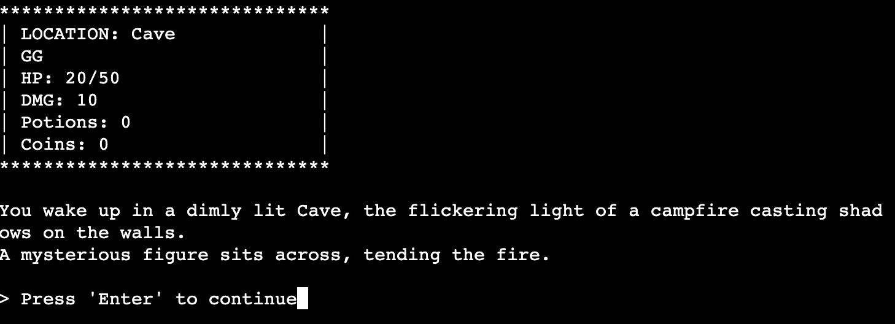
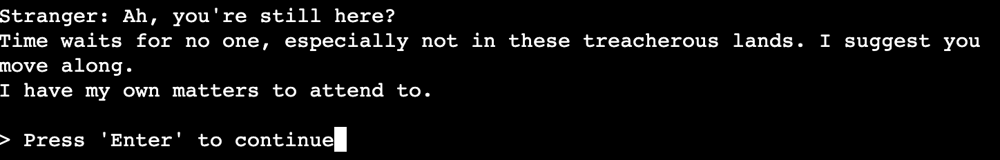
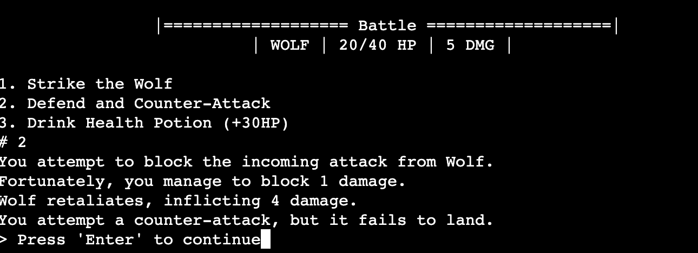
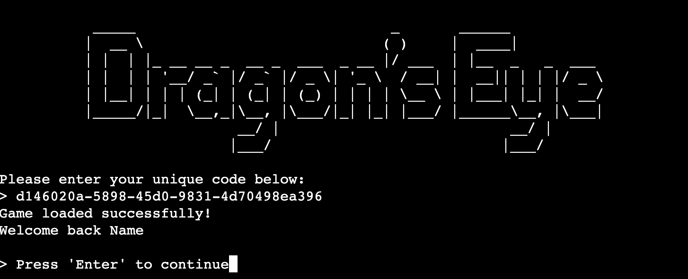

# Dragon's Eye

"Dragon's Eye" is a text-based RPG developed in Python. Dive into a fantasy world where your choices matter. Engage with NPCs, explore diverse locations, and battle foes. Complete quests for rewards and face the ultimate boss. Features auto-save to keep your progress.

[Play the Dragon's Eye](https://dragons-eye-d4c0a4063c21.herokuapp.com/)

- - -

## Table of content

- [Description](#dragons-eye)
- [Table of content](#table-of-content)
- [Logic flowchart](#logic-flowchart)
- [Features](#features)
    - [Easy Game Start](#easy-game-start)
    - [Engaging RPG-Style Storytelling](#engaging-rpg-style-storytelling)
    - [Dialogs with NPCs](#dialogues-with-npcs)
    - [Rules Section](#rules-section)
    - [Multiple Locations](#multiple-locations)
    - [Environment Interactions](#environment-interactions)
    - [Combat System](#combat-system)
    - [Quests and Rewards](#quests-and-rewards)
    - [Final Boss and Game Ending](#final-boss-and-game-ending)
    - [Main Unspoken Quest](#main-unspoken-quest)
    - [Error Handling for Incorrect Inputs](#error-handling-for-incorrect-inputs)
    - [Auto-Save and Unique Load Code](#auto-save-and-unique-load-code)
    - [Engaging Game Over Screen](#engaging-game-over-screen)
    - [RPG-Styled Game Exit](#rpg-styled-game-exit)
- [Future features](#future-features)
- [Technologies](#technologies)
- [Frameworks, Libraries & Programs](#frameworks-libraries--programs)
- [Testing](#testing)
    - [PEP8 linter](#pep8-linter)
    - [Manual testing](#manual-testing)
    - [Known bugs](#known-bugs)
- [Deployment and local development](#deployment-and-local-development)
    - [Local Development](#local-development)
    - [Deployment](#deployment-to-heroku)
- [Credits](#credits)
    - [Acknowledgements](#acknowledgements)
    - [Content](#content)

- - -

## Logic flowchart

- - -

## Features

### Easy Game Start

 - To begin your adventure, simply press `New Game` and enter your name. No complicated character creation required.

### Engaging RPG-Style Storytelling

 - Players are immersed in an engaging story that unfolds as they progress, written in the classic RPG style.

### Dialogues with NPCs

 - Players can interact with various Non-Playable Characters (NPCs) for information, quests.

 - Dialogues change based on quest progress and previous interactions, offering a dynamic conversational experience.

 - Engage in conversations with NPCs and make choices using Yes/No responses, affecting the outcome of quests and interactions.

### Rules Section

 - Familiarize yourself with the gameplay mechanics through the 'Rules' option in the main menu.

### Multiple Locations

 - The game includes 6 unique locations, each offering its own quests, enemies, and exploration opportunities:
   Cave, Forest, Village, Castle, Doomed Path and Mountain Peak

### Environment Interactions

 - Players can search the environment to find useful items like gold or health potions.

### Combat System

 - The combat system allows players to attack enemies and defend themselves, with a chance for counter-attacks.

 - Player have option to Attack:

 - and Defend with random chance to block damage from 1 to full enemy damage:

 - Defending also has 30% chance to Counter-Attack:

### Quests and Rewards

 - The game offers a variety of quests with rewards such as gold and equipment upgrades.

### Final Boss and Game Ending

 - A final boss awaits players at the end of the game. Defeating it is a significant milestone but not the ultimate goal. You have to come back to the Cave (first location) and finish the game by talking to Stranger

### Main Unspoken Quest

 - After defeating the final boss, players must complete a main unspoken quest by delivering the dragon's eye to the Stranger in the cave, who once helped them at the beginning of the game.

### Error Handling for Incorrect Inputs

 - If you enter an invalid option, the game provides helpful prompts to guide you back to the available choices, ensuring a smooth and user-friendly experience.

### Auto-Save and Unique Load Code

 - The game automatically saves at various stages, allowing players to return to their last saved point in case of failure. Players can also load their game using a unique code.

 - Unique Code:

 - Load the game by unique code:

### Engaging Game Over Screen

 - Experience a narrative-driven Game Over screen in the style of classic RPGs. From here, you have the option to return to the main menu to start a new game, load a previous save using your unique code, or exit the game.

### RPG-Styled Game Exit

 - Exiting the game is also designed in an RPG style, providing a thematic and immersive end to your gaming session.

- - -

## Future features

### Transition to 2D or 3D Indie RPG-Game

 - The game has the potential to be expanded into a full-fledged 2D or 3D indie RPG game, offering a more immersive experience.

### Expanded Quests, Weapons, and Armor

 - Plans to scale the game include adding a variety of new quests, weapons, and armor sets to enrich gameplay and offer more choices to the player.

### Enhanced Combat System

 - The combat system will be refined and expanded to include more tactical elements, special moves, and possibly even magic spells.

### Game Reload After Death

 - To enhance the user experience, a feature is planned where the game will automatically offer to reload the last save point immediately after the player character's death, eliminating the need to manually enter a unique code.

- - -

## Technologies

 - [Python](https://en.wikipedia.org/wiki/Python_(programming_language))

 - Libraries Using: 
   - `os` library: 
      to create a function that clear the terminal
   - `shutil` library: 
      to get a terminal width
   - `random` library: 
      to create a random chance for different events (attack/special attack, defend damage, counter-attack chance, coins drop)
   - `uuid` library: 
      to create a unique code for loading saves
   - `time` library: 
      to create typing effect

- - -

## Frameworks, Libraries & Programs

* [Git](https://git-scm.com/download/mac)
  * for version control.
* [Github](https://github.com/)
  * for storing the project and deployment.
* [Fleet](https://www.jetbrains.com/fleet/)
  * IDE for coding.
* [Draw.io](https://app.diagrams.net/)
  * for flowcharts.
* [Heroku](https://dashboard.heroku.com/)
  * To deploy the project.
* [CI Python Linter](https://pep8ci.herokuapp.com/)
  * Check code for any issues.

- - -

## Testing

### PEP8 linter

No errors and warnings found with [PEP8 CI linter](https://pep8ci.herokuapp.com/)

### Manual testing

During the development of the game, extensive manual testing was performed to ensure the game runs smoothly and is free of bugs. Below are some of the key areas that were focused on:

- **Gameplay Mechanics** 

  Multiple playthroughs were conducted to test the core gameplay mechanics, including combat, dialogues, and quest completion.

- **Error Handling** 

  Various incorrect inputs were deliberately entered to test the game's error-handling capabilities. This includes entering invalid options, attempting to use items not in the inventory, and so on.

- **Quests and NPC Interactions** 

  All quests were repeatedly completed to ensure they trigger and resolve as expected. 

  NPC dialogues were tested for branching conversations and to ensure they change appropriately based on quest status.

- **Save and Load Functionality** 

  The save and load feature was tested using unique codes to ensure that game progress is accurately captured and restored.

- **Game Over Scenarios** 

  Different game-over conditions were triggered to ensure that the game handles them appropriately, offering options to restart or load a saved game.

### Known bugs

**Copy-Paste Interruption**

 - Attempting to copy the unique code for game loading by pressing `Ctrl + C` can inadvertently stop the game's code execution.

- - -

## Deployment and local development

### Local Development

To start working on the DueWeather project locally, follow these steps:
1. **Clone the Repository:** Clone the GitHub repository to your local machine using the following command in your terminal:  
   `git clone https://github.com/GenaPlem/rpg_game.git`
2. Navigate to the Project Directory: Change to the project directory: 
   `cd rpg_game`
3. **Open in a Code Editor:** Use your preferred code editor to open the project files.
4. **Make Changes:** Edit and customize the files according to your requirements.
5. **Test Locally:** Run the run.py in a terminal with command  `python3 run.py` to preview the changes locally.

### Deployment to Heroku

To deploy with Heroku, Code Institute Python Essentials Template was used so the python code can be viewed in a terminal in a browser

1. Log in to [Heroku](https://dashboard.heroku.com) or create a new account
2. On the main page click `New` and select `Create new app`
3. Choose your unique app name and select your region
4. Click `Create app`
5. On the next page find `Settings` and locate `Config Vars`
6. Click `Reveal Config Vars` and add `PORT` key and value `8000`, click `Add`
7. Scroll down, locate `Buildpack` and click `Add`, select `Python`
8. Repeat step `7` only this time add `Node.js`, make sure `Python` is first
9. Scroll to the top and select `Deploy` tab
10. Select `GitHub` as deployment method and search for your repository and link them together
11. Scroll down and select either `Enable Automatic Deploys` or `Manual Deploy`
12. Deployed site with the [Game](https://dragons-eye-d4c0a4063c21.herokuapp.com/)

- - -

## Credits

### Acknowledgements

**Special Thanks to My Mentor [Mitko Bachvarov](https://github.com/MitkoBachvarov):** I would like to extend my deepest gratitude to my mentor for their invaluable support and guidance throughout the development of this project. Your expertise and insights have been instrumental in bringing this RPG game to life.

**[Stack Overflow](https://stackoverflow.com/) community:** A big thank you to the Stack Overflow community for providing helpful articles and solutions that aided in debugging and enhancing the code for this project.

### Content

All content was written by the developer.